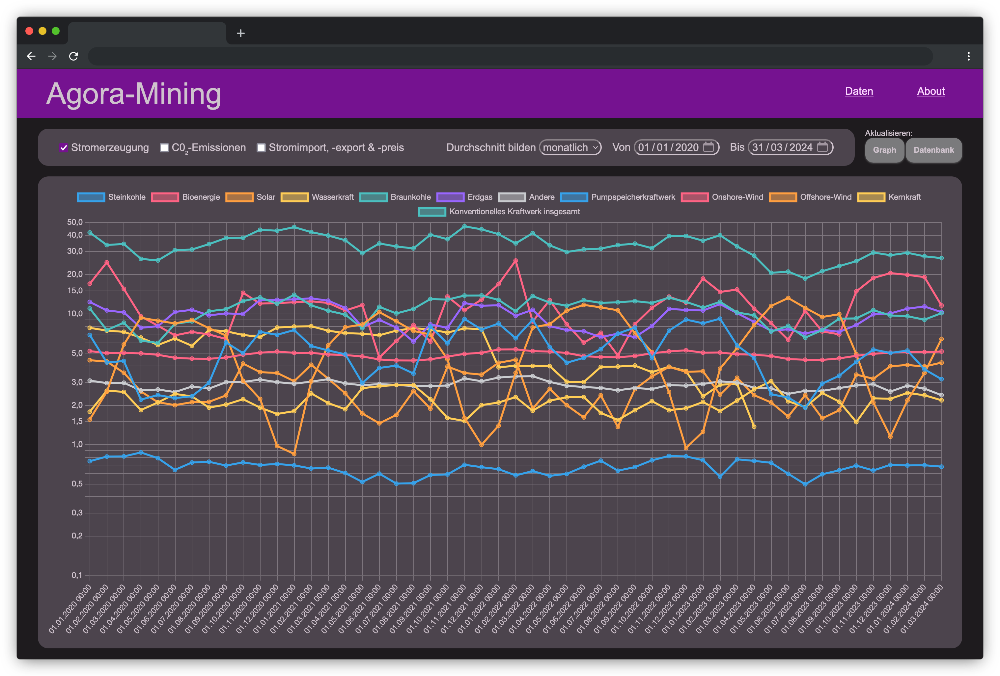

# AgoraMining

Dieses Projekt entstand im Rahmen der Ausbildung zum Fachinformatiker Anwendungsentwicklung am Oberstufenzentrum Informations- und Medizintechnik in Berlin. Es soll in einer Gruppenarbeit über 5 Wochen eine Software entwickelt werden.

## Aufgabenstellung

Die Energiedaten der Website https://www.agora-energiewende.de/service/agorameter/ sollen von der Website per Software für einen beliebigen Zeitraum abgegriffen und in eine Datenbank überführt werden. Es stehen Ihnen die Anforderungen für die Softwareentwicklung zur Verfügung und die Bewertung erfolgt in den wichtigsten Meilensteinen. Sie entwickeln jeweils zusätzlich ein Muss-, Soll- und Kannkriterium.
